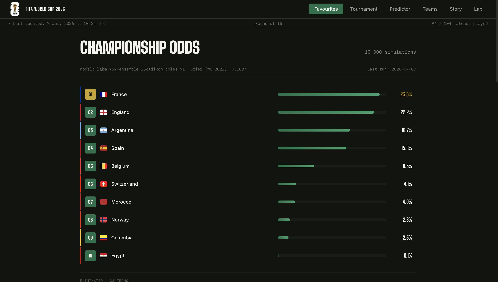
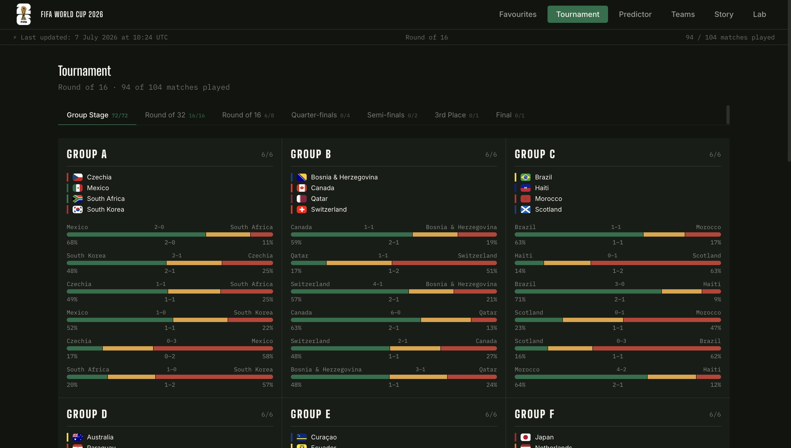
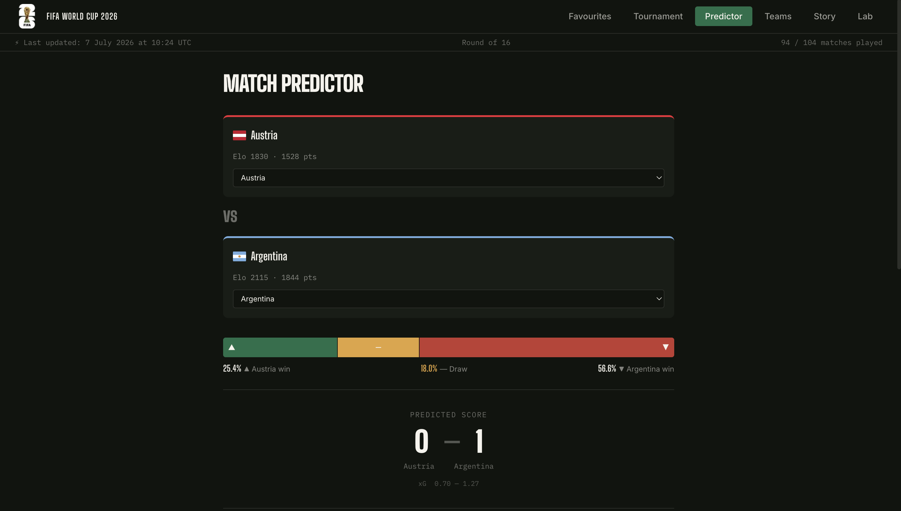
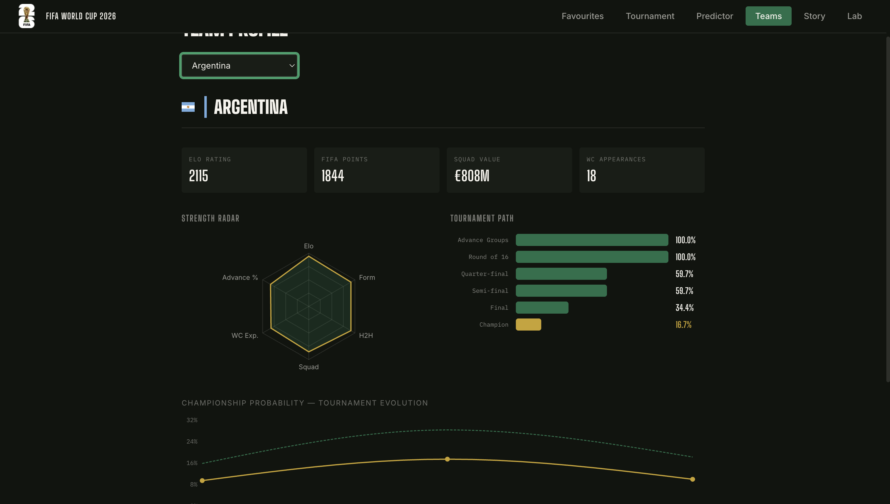
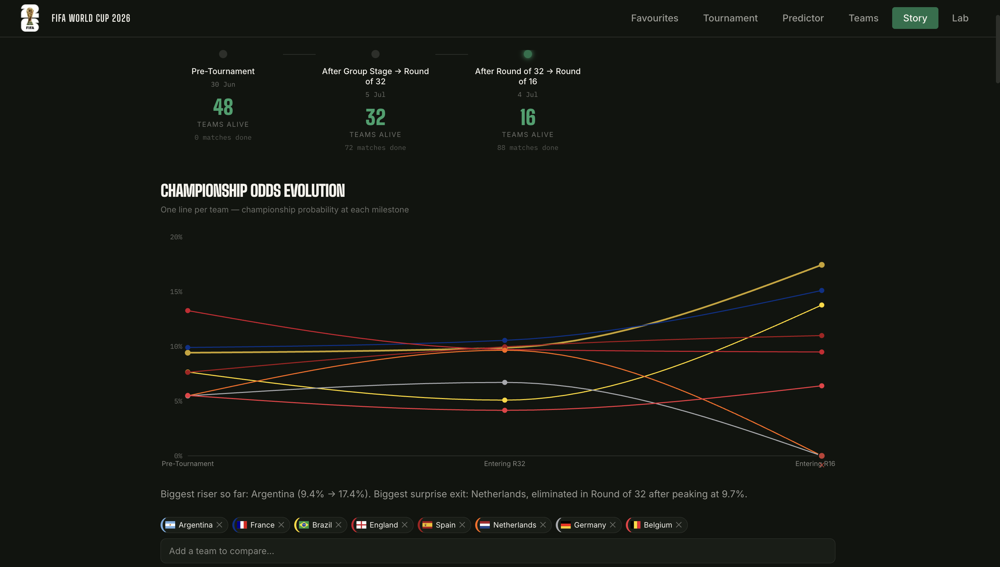
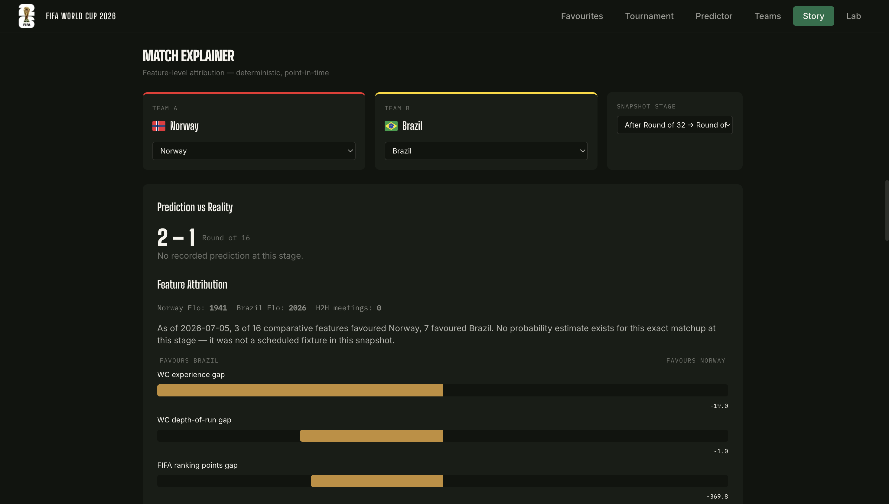

<p align="center">
  
</p>

<h1 align="center">FIFA World Cup 2026 — ML Prediction System</h1>

<p align="center"><strong>A complete, end-to-end machine learning system that predicts FIFA World Cup 2026 outcomes — trained on 18 years of international football data, live-updating throughout the tournament, and fully explainable at the match level.</strong></p>

<p align="center">🔗 <strong><a href="https://fifa-world-cup-predictor-vineet.vercel.app/">Live demo</a></strong> — deployed on Vercel (frontend) and Railway (backend)</p>



---

## What this is

This project forecasts every stage of the 2026 World Cup — from pre-tournament championship odds for all 48 teams, through to individual match predictions — using a stacked ensemble of seven machine learning models trained on historical international football data.

It isn't a static, one-time prediction. Once the tournament kicked off, the system began **retraining itself after every matchday**: ingesting real results, updating Elo ratings, retraining its fastest model, and re-running 10,000 Monte Carlo tournament simulations to produce fresh odds for every remaining match and every remaining team.

Every prediction the model has ever made is preserved in a timestamped snapshot history, which powers a dedicated **Story** page — a feature-level explanation of *why* the model favoured one team over another at any point in the tournament, and an honest, point-in-time accuracy report that never scores a prediction against results it couldn't have known about in advance.

---

## Table of contents

- [Features](#features)
- [How predictions actually work](#how-predictions-actually-work)
  - [1. Data collection](#1-data-collection)
  - [2. Feature engineering](#2-feature-engineering)
  - [3. Model training](#3-model-training)
  - [4. Tournament simulation](#4-tournament-simulation)
  - [5. Live retraining during the tournament](#5-live-retraining-during-the-tournament)
- [Model performance](#model-performance)
- [Dashboard pages](#dashboard-pages)
- [Architecture](#architecture)
- [Tech stack](#tech-stack)
- [Project structure](#project-structure)
- [Running it locally](#running-it-locally)
- [Deployment](#deployment)
- [Key engineering decisions](#key-engineering-decisions)
- [Known limitations](#known-limitations)
- [License](#license)

---

## Features

- **48-team, 104-match coverage** of the entire WC 2026 tournament — group stage through Final
- **Seven trained models** feeding a stacking ensemble: Logistic Regression, Random Forest, XGBoost, LightGBM, a Dixon-Coles Poisson scoreline model, a PyTorch neural network, and a meta-learner combining them
- **10,000-run Monte Carlo simulation** of the full bracket, respecting FIFA's actual tiebreaker rules and a penalty-shootout sub-model for knockout draws
- **Live retraining pipeline** that ingests real results after every matchday, updates Elo ratings, retrains the fastest model, and re-simulates the remaining tournament
- **Automatic milestone snapshots** (pre-tournament, post-group-stage, post-R32, post-R16, post-QF, post-SF) that build a permanent, queryable history of every prediction the system has ever made
- **A fully explainable Match Predictor** — every prediction shows the underlying feature comparison, not just a probability
- **A Story page** dedicated to showing how predictions evolved, why they changed, which upsets the model missed, and how well-calibrated its confidence actually was — evaluated honestly, with no hindsight
- **A distinctive, sports-broadcast-inspired dark UI** — jersey-number rank badges, kit-colour team accents, a printed-wall-chart-style group grid, and a stadium-scoreboard number reveal animation

---

## How predictions actually work

The full pipeline, in the order data actually flows through it.

### 1. Data collection

Seven independent sources feed the model, each contributing a different kind of signal:

| Source | What it provides |
|---|---|
| **Kaggle historical match database** | ~47,000+ international matches back to 1872, the backbone of the training set |
| **Elo ratings** | A continuously-updated strength rating per national team, the single strongest predictive signal in the model |
| **FIFA World Ranking points** | An independent official strength measure that weights recent, high-profile results differently from Elo |
| **[football-data.org](https://www.football-data.org/)** | Live WC 2026 results, group standings, and bracket data during the tournament (free tier, includes the World Cup) |
| **Transfermarkt** | Squad market values — a proxy for current playing talent, distinct from historical results |
| **FBref** | Match-level shooting and goalkeeping statistics (used experimentally; two derived features were dropped after being found >99% missing — see [Known limitations](#known-limitations)) |
| **Official WC 2026 schedule** | The confirmed 104-match fixture list, groups, and dates |

### 2. Feature engineering

Every match is converted into a feature vector computed **strictly as of the day before that match** — no feature is ever allowed to see information from the future, including during model training. Two feature sets exist because different model families handle correlated inputs differently:

- **21 features** for tree-based and neural network models (`FEATURE_COLS_TREES`)
- **15 features** for the linear model (`FEATURE_COLS_LINEAR`) — a reduced set with the most collinear features removed

Features fall into five categories:

- **Team strength** — Elo rating and its difference, Elo momentum over the last 90 days, FIFA ranking point difference, squad market value (log-transformed difference)
- **Recent form** — points per game, goals scored/conceded per game, clean-sheet rate, win rate — all computed over each team's last 10 competitive matches
- **Head-to-head history** — win rate, average goal margin, and meeting count between the two specific teams, filtered to the last 10 years
- **Tournament context** — World Cup appearances, historical depth of run, rest days between matches, and a round-importance weight (group stage vs. knockout)
- **Neutral-venue form** — a separate win-rate feature computed only from away/neutral matches, since every WC 2026 fixture is played at a neutral venue

### 3. Model training

Seven models are trained with a strict temporal split — data before 2018 for training, the actual WC 2018 tournament held out for validation, and WC 2022 touched exactly once as a final, untouched test set:

| Model | Role |
|---|---|
| Logistic Regression | Baseline classifier and the stacking ensemble's meta-learner |
| Random Forest | Robust tree baseline, doubles as a feature-importance check |
| XGBoost | Primary gradient-boosted classifier, tuned via 100 rounds of Optuna hyperparameter search |
| LightGBM | A faster gradient-boosted variant, tuned via 50 Optuna rounds — this is the model retrained live during the tournament |
| Dixon-Coles (Poisson) | A classical football analytics model estimating each team's attack/defence strength; used *only* to generate realistic scorelines, never for win/draw/loss decisions |
| Neural Network (MLP) | A 3-layer PyTorch network on the tabular feature set |
| **Stacking Ensemble** | A meta-learner trained on out-of-fold predictions from all of the above, using `TimeSeriesSplit` cross-validation throughout — this is the model that actually decides match outcomes |

The ensemble is built manually rather than with `sklearn.StackingClassifier`, because its base models use two different feature sets (21 tree features vs. 15 linear features) — something the standard scikit-learn class doesn't support directly.

### 4. Tournament simulation

A Monte Carlo engine simulates the entire 104-match bracket **10,000 times** to convert individual match probabilities into tournament-wide outcomes:

1. All 72 group-stage matches are simulated — outcome from the ensemble, scoreline sampled from Dixon-Coles' expected goals, conditioned to match the sampled outcome
2. Group tables are resolved using FIFA's actual eight-criterion tiebreaker order (points → goal difference → goals scored → head-to-head → …)
3. The best eight third-place finishers across all twelve groups are selected
4. The Round of 32 bracket is built and simulated, followed by R16, quarter-finals, semi-finals, the third-place match, and the Final
5. Any knockout match that ends level after 90 minutes goes to a penalty-shootout model, weighted slightly by Elo but kept close to 50/50, matching real-world shootout unpredictability

Repeating this 10,000 times and counting outcomes produces a genuine probability distribution — "France wins the tournament in 23% of simulated outcomes" — rather than a single deterministic guess.

**Why two models are involved in every simulated match:** the ensemble decides *who wins* (it's the more accurate model for that decision — see [Model performance](#model-performance)); Dixon-Coles' historical attack/defence ratings decide *by how much*, since it was never reliable for W/D/L on its own. Scorelines are always sampled *conditioned on* the ensemble's chosen outcome, which guarantees the reported score never contradicts the reported win probability.

### 5. Live retraining during the tournament

Once the tournament began, the system stopped being a static prediction and became a continuously-updating one:

- Real results are ingested from football-data.org after each matchday
- Elo ratings update using the actual results (K-factor 40, the standard World Cup weighting)
- LightGBM retrains on the extended dataset, with WC 2026 matches weighted 3× more heavily than historical data
- A Brier-score guardrail evaluates the retrained model before deploying it — if quality regresses beyond a threshold, the previous model is kept instead
- Predictions are produced by a **weighted blend** of the freshly retrained LightGBM and the frozen, historically-calibrated ensemble. The blend weight shifts automatically toward LightGBM as more real WC 2026 data accumulates (`min(matches_played / 100, 0.75)`), capped at 75% so the ensemble's broader calibration is never fully discarded
- The Monte Carlo simulation re-runs from the tournament's actual current state — completed matches are treated as fixed facts, not simulated, and only the genuinely remaining matches are re-simulated

A named snapshot is automatically saved at each major milestone (`pre_tournament`, `post_group_stage`, `post_r32`, `post_r16`, `post_qf`, `post_sf`), alongside a full timestamped history of every single pipeline run. This snapshot history is what powers the Story page's prediction-evolution charts.

---

## Model performance

Evaluated on **WC 2022 as a held-out test set, touched exactly once**, after all hyperparameter tuning was completed against WC 2018 validation data only.

| Model | Brier score (WC 2018 validation) |
|---|---|
| Naive baseline (historical base rates) | 0.2194 |
| Logistic Regression | 0.1957 |
| XGBoost | 0.2024 |
| LightGBM | 0.2025 |
| Random Forest | 0.2028 |
| Neural Network (MLP) | 0.2269 |
| Dixon-Coles (Poisson) | 0.2479 |
| **Stacking Ensemble** | **0.1990** |

| | **Stacking Ensemble — WC 2022 test set** |
|---|---|
| Brier score | **0.1897** |
| Accuracy | 57.8% |

Lower Brier is better — 0.000 is a perfect forecast, ~0.444 is equivalent to random guessing on a three-outcome (win/draw/loss) problem, and published academic benchmarks for international football prediction typically fall in the 0.19–0.21 range. A 0.1897 Brier on a genuinely held-out World Cup — one the model's hyperparameters were never tuned against — indicates the ensemble is extracting real signal rather than overfitting to its validation set.

Individually, Logistic Regression outperforming every tree-based model on validation is a deliberately interesting result, not an oversight: it suggests the strongest signals in the feature set (Elo difference, recent form) relate to match outcome in a largely linear way in log-odds space, and that the tree models' extra flexibility mostly adds noise on a 64-match validation set rather than genuine additional signal. Dixon-Coles' relatively poor Brier score is expected and intentional — it was never meant to predict win/draw/loss directly, only to supply realistic goal-scoring rates for simulated scorelines.

---

## Dashboard pages

### 🏆 Favourites
The championship leaderboard — all remaining teams ranked by simulated title probability, with the current tournament round, last-updated timestamp, and match-progress count shown in a persistent status bar. Eliminated teams are shown separately, tagged with the round they exited in.

### ⚽ Tournament
A round-by-round bracket view — Group Stage, Round of 32, Round of 16, Quarter-finals, Semi-finals, 3rd Place, and Final — each shown as its own tab with a completion count (e.g. "Round of 16 · 6/8"). Completed matches show the actual result alongside what the model predicted beforehand, with a clear correct/incorrect indicator; upcoming matches show the model's live forecast and predicted scoreline.



### 🔮 Predictor
A head-to-head match predictor for any pairing of the 48 teams — including hypothetical matchups that were never scheduled. Shows win/draw/loss probability, a predicted scoreline, and the underlying feature comparison driving that specific prediction.



### 📊 Teams
A per-team deep dive: Elo rating, FIFA ranking points, squad value, and World Cup experience, a radar chart comparing the team across six strength dimensions, its full projected tournament path (probability of reaching each remaining round), and a line chart showing how its championship odds have moved across every tournament milestone.



### 🧭 Story
The project's most detailed page — how every team's odds evolved from pre-tournament through the present, which teams rose or fell the most and why (backed by their actual match results and Elo changes, not narrative guesswork), a **Match Explainer** that reconstructs the exact feature vector the model saw for any matchup at any past tournament stage and shows which features favoured which team, and an honest accuracy report: every prediction is scored only against results that came *after* it was made, with a full calibration curve and a dedicated "where the model was wrong" upsets list.





### 🧪 Lab
Model performance and validation detail — the full Brier score comparison table across all seven models, the frozen WC 2022 benchmark, and a live-updating accuracy tracker measured against actual WC 2026 results as they come in.

---

## Architecture

```
┌─────────────────────┐         ┌──────────────────────────┐
│   Next.js Frontend   │  HTTPS  │      FastAPI Backend      │
│   (Vercel)           │ ──────► │      (Railway)            │
│                       │         │                            │
│  Server Components    │         │  ├─ /api/teams            │
│  fetch fresh data on  │         │  ├─ /api/simulation        │
│  every request — no   │         │  ├─ /api/predict           │
│  client-side caching  │         │  ├─ /api/story/*           │
│                       │         │  ├─ /api/admin/*  (token)  │
└───────────────────────┘         │  └─ background scheduler   │
                                   │      (in-process)          │
                                   └──────────┬─────────────────┘
                                              │
                          ┌────────────────────┴────────────────────┐
                          │           Persistent Volume               │
                          │  data/       — feature matrix, Elo,       │
                          │                predictions, snapshots     │
                          │  models/     — 7 trained models            │
                          └────────────────────────────────────────────┘
```

The backend is a single always-on process: the FastAPI server and the live-retraining scheduler run in the same container, sharing the same in-memory model objects. This keeps the deployed system to one service rather than two, at the deliberate cost of them sharing fate — a design choice suited to a personal-scale deployment rather than a large production system.

All prediction and simulation data lives on a persistent volume, independent of the application code's own container lifecycle — code deployments never touch the tournament's accumulated prediction history.

---

## Tech stack

**Backend**
- Python · FastAPI · Uvicorn
- pandas, NumPy, scikit-learn, XGBoost, LightGBM, PyTorch, statsmodels
- Optuna (hyperparameter search), MLflow (experiment tracking)
- APScheduler (background retraining schedule)
- Docker (CPU-only PyTorch build for a lean deployment image)

**Frontend**
- Next.js 16 (App Router) · React 19 · TypeScript
- Tailwind CSS v4
- Recharts (charts), Framer Motion (the odometer-style number reveal), flag-icons

**Data & deployment**
- football-data.org (live results), Kaggle, Transfermarkt, FBref (historical data)
- Vercel (frontend hosting)
- Railway (backend hosting, persistent volume storage)

---

## Project structure

```
├── src/
│   ├── api/                  FastAPI app, routers, request/response schemas
│   │   └── routers/          teams, simulation, predict, story, model, admin
│   ├── features/              Point-in-time feature engineering pipeline
│   ├── models/                 The 7 trained models + the stacking ensemble
│   ├── simulation/            Monte Carlo tournament engine (Phase 4)
│   └── retraining/            Live retraining pipeline (Phase 6)
│       ├── ingestion.py       Pulls real results from football-data.org
│       ├── elo_updater.py     Updates Elo ratings from real results
│       ├── retrain.py         Fast LightGBM retrain
│       ├── live_simulation.py Re-simulates from the tournament's real state
│       ├── pipeline.py        Orchestrates the full retrain cycle
│       ├── scheduler.py       Runs the pipeline automatically twice daily
│       └── snapshots.py       Milestone + full-history snapshot system
│
├── scripts/                   One-off and operational scripts (training,
│                               catch-up, manual pipeline triggers)
│
├── config/                    Settings and canonical team-name mappings
│
├── web/                       Next.js frontend
│   ├── app/                   Page routes (Favourites, Tournament,
│   │                           Predictor, Teams, Story, Lab)
│   ├── components/            Page-level and shared UI components
│   └── lib/                   Typed API client, shared types, flag/kit lookups
│
├── data/                      Feature matrix, predictions, snapshots (gitignored)
├── models/                    Trained model artifacts (gitignored)
│
├── Dockerfile
└── requirements.txt
```

---

## Running it locally

**Backend**
```bash
python -m venv worldcup
source worldcup/bin/activate
pip install -r requirements.txt

# .env — required
FOOTBALL_DATA_API_KEY=your_key
ADMIN_TOKEN=any_random_string
MLFLOW_TRACKING_URI=file:./mlruns

uvicorn src.api.main:app --reload --port 8000
```

**Frontend**
```bash
cd web
npm install

# .env.local
NEXT_PUBLIC_API_URL=http://localhost:8000

npm run dev
```

Model artifacts (`models/*.pkl`) and processed data (`data/processed/*.parquet`) are required for the API to serve predictions, but are not committed to this repository due to their size — they are produced by the training pipeline in `scripts/`.

---

## Deployment

- **Frontend** — deployed on [Vercel](https://vercel.com), auto-deployed from this repository's `web/` directory
- **Backend** — deployed on [Railway](https://railway.app) as a single Docker container with an attached persistent volume, running both the API and the retraining scheduler in one process
- Live retraining runs automatically twice daily during the tournament, with a manual, token-protected trigger endpoint available for on-demand updates after a specific match result

---

## Key engineering decisions

A few choices worth calling out explicitly, since they weren't the obvious default:

- **Dixon-Coles never decides who wins.** Despite being a well-established football analytics model, its win/draw/loss accuracy was measurably worse than every other model tested. It's used exclusively for its well-calibrated expected-goals output, feeding realistic scorelines conditioned on outcomes decided elsewhere.
- **Scorelines are always sampled consistent with the win probability**, never independently — an earlier version of this pipeline occasionally showed a team favoured to win with a lower predicted score than their opponent, which is corrected by conditioning the scoreline sample on the already-chosen match outcome rather than sampling both independently.
- **The Story page's accuracy evaluation never uses hindsight.** Every prediction is scored only against the specific snapshot that existed *before* those results were known — group-stage results are checked against pre-tournament predictions, not predictions made after the fact.
- **The live retraining blend is capped, never fully replacing the frozen ensemble.** Even late in the tournament, at least 25% weight stays with the ensemble trained on 18 years of historical data, since a model retrained purely on ~100 WC 2026 matches would be prone to overfitting on a small, unusual sample.
- **Feature vectors are point-in-time reconstructible** — any feature used in any historical prediction can be recomputed exactly as it appeared before any given match, which is what makes the Match Explainer's retrospective feature attribution possible at all.

---

## Known limitations

- Two FBref-derived features (`xg_diff_per_game`, `sot_pct_diff`) were found to be 100% and 99.2% missing respectively during feature analysis and were dropped from the model entirely — the underlying data source doesn't provide expected-goals statistics for international matches on its free tier.
- WC 2026 is the first 48-team World Cup and the first ever to include a Round of 32 — there is no historical precedent for that specific bracket stage, which the model has no way to fully account for.
- Live retraining introduces a small amount of look-ahead within a single matchday: the retrained model has seen that matchday's results when producing predictions for *subsequent* matches on the same update cycle. This is a deliberate, bounded tradeoff in favour of timeliness — it does not affect the frozen WC 2022 benchmark score, which remains a clean, hindsight-free evaluation.
- The `post_group_stage` milestone snapshot was rebuilt once after a data-source fix early in the tournament; it reflects real group-stage results but was generated using the LightGBM model as it existed at rebuild time rather than exactly as it stood on the day groups concluded.

---

## License

MIT — see [LICENSE](LICENSE).

## Author

**Vineet Channe**
